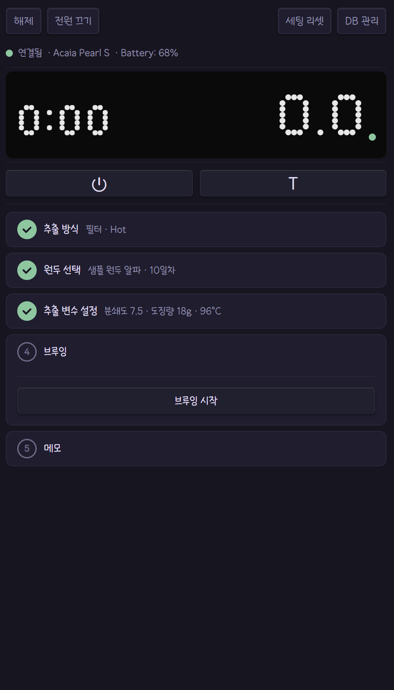
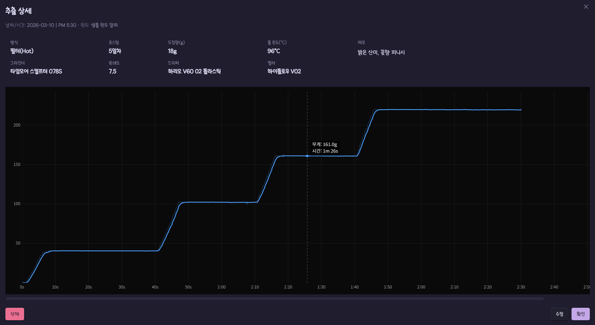

# CubicJ Brewing

[](LICENSE)


[English](README.md)

커피 브루잉을 위한 [Obsidian](https://obsidian.md) 플러그인 — 실시간 BLE 저울 연동, 가이드 브루잉 플로우, 구조화된 기록 관리를 옵시디언 노트 안에서 기록합니다.

> 현재 **Windows**에서 **Acaia Pearl S**를 지원합니다. 다른 Acaia 모델 및 플랫폼은 계획 중입니다.

<p align="center">
  
  <br>
  <em>라이브 브루잉 세션 — Acaia Pearl S를 통한 실시간 무게 추적 및 프로파일 차트</em>
</p>

## 기능

- **실시간 저울 연결** — Acaia Pearl S 블루투스 연동
- **가이드 브루 플로우** — 5단계 아코디언 UI (방식 → 원두 → 파라미터 → 추출 → 저장)
- **필터 & 에스프레소 모드** — 추출 방식별 파라미터
- **라이브 브루 프로파일 차트** — 추출 중 실시간 무게-시간 그래프 기록
- **원두 인벤토리** — 로스팅 일수, 남은 원두 무게, 상태 추적
- **브루 히스토리** — 원두별 기록, 추출 그래프 및 사용 장비
- **장비 관리** — 그라인더, 드리퍼, 필터, 바스켓, 액세서리
- **볼트 네이티브 저장** — 모든 데이터를 일반 파일로, Obsidian Sync 호환
- **다국어 지원** — 한국어, 영어, 커뮤니티 확장 가능

## 요구사항

- **Obsidian Desktop** (Electron 기반 — BLE에 네이티브 애드온 필요)
- **Windows** + Bluetooth LE 지원
- **Acaia Pearl S** 저울

> macOS/Linux 지원은 [@stoprocent/noble](https://github.com/nicedoc/noble) 플랫폼 호환성에 따라 다릅니다. 아직 테스트되지 않았습니다.

## 설치

1. [최신 릴리즈](https://github.com/cubicj/CubicJ-Brewing/releases/latest)에서 `cubicj-brewing.zip` 다운로드
2. zip 압축 해제 — `main.js`, `manifest.json`, `styles.css`, `noble/` 폴더가 있어야 합니다.
3. 모든 내용을 `<볼트 경로>/.obsidian/plugins/cubicj-brewing/`에 복사
4. Obsidian 재시작 → 설정 → 커뮤니티 플러그인 → "CubicJ Brewing" 활성화

> `noble/` 폴더는 네이티브 BLE 애드온입니다 — 빠뜨리지 마세요.

## 사용법

### 원두 인벤토리 (`beans` 코드블록)

아무 노트에 `beans` 코드블록을 넣으면 원두 인벤토리 허브가 됩니다:

````markdown
```beans

```
````

<p>
  
  <br>
  <em>원두 인벤토리 — 원두별 로스팅 일수, 남은 원두 무게, 상태 추적</em>
</p>

- **사용 중 / 완료** 섹션 — 상태별 원두 그룹
- **로스팅 일수** — 로스팅 날짜에서 자동 계산, 매일 갱신
- **잔여 무게** — 클릭하여 설정, 추가, 차감 (저울 자동 읽기 옵션)
- **상태 전환** — 완료 또는 재구매 (새 로스팅 날짜 입력)
- **새 원두 버튼** — frontmatter 템플릿과 `brews` 블록이 포함된 원두 노트 생성

> `beans` 블록은 **자동 생성되지 않습니다** — 원하는 노트에 직접 추가하세요 (예: "커피 대시보드" 노트). 볼트당 하나면 충분합니다.

### 원두 노트

각 원두는 `type: bean` frontmatter가 있는 일반 노트입니다:

```yaml
---
type: bean
roaster: 내 로스터
status: active
roast_date: 2026-03-01
weight: 200
---
```

플러그인은 Obsidian의 메타데이터 캐시를 통해 원두를 발견합니다 — 특별한 폴더 구조가 필요 없습니다.

### 브루 기록 (`brews` 코드블록)

각 원두 노트에는 브루 히스토리를 보여주는 `brews` 코드블록이 포함됩니다 (새 원두 생성 시 자동 삽입):

````markdown
```brews

```
````

<p>
  
  <br>
  <em>원두별 브루잉 히스토리 테이블</em>
</p>

<p>
  
  <br>
  <em>브루잉 상세 — 추출 파라미터와 무게-시간 그래프</em>
</p>

---

## 아키텍처

```
TypeScript · vitest · esbuild CommonJS 번들
```

| 레이어        | 주요 컴포넌트                                                                   |
| ------------- | ------------------------------------------------------------------------------- |
| **BLE**       | 바이너리 프로토콜 코덱, 패킷 버퍼 (프래그먼트 처리), 타입드 EventEmitter 서비스 |
| **브루 상태** | 6단계 유한 상태 머신, 스텝 가드, 판별 유니온 레코드                             |
| **신호 처리** | 중앙값 스파이크 필터, Savitzky-Golay 스무딩 (2차), EMA 트렌드 라인              |
| **저장**      | 파일 어댑터 추상화, JSON CRUD + 스키마 검증, 손상 파일 백업                     |
| **뷰**        | 아코디언 매니저, 스테퍼 컴포넌트, Canvas 2D 차트, 코드블록 프로세서             |

## 개발

```bash
npm run dev          # 워치 모드 + 볼트 자동 복사
npm run build        # 테스트 → 타입체크 → 프로덕션 빌드
npm run test         # vitest (단일 실행)
npm run test:watch   # vitest (워치 모드)
npm run check        # 타입체크만
npm run lint         # eslint
```

### 소스에서 빌드

```bash
git clone https://github.com/cubicj/CubicJ-Brewing.git
cd CubicJ-Brewing
npm install
npm run build
npm run release      # 릴리즈 zip 생성
```

## 감사의 말

- [Matrix Sans](https://github.com/FriedOrange/MatrixSans) 도트 매트릭스 폰트 — [SIL Open Font License 1.1](FONT-LICENSE-OFL.txt)

## 라이선스

[MIT](LICENSE)
