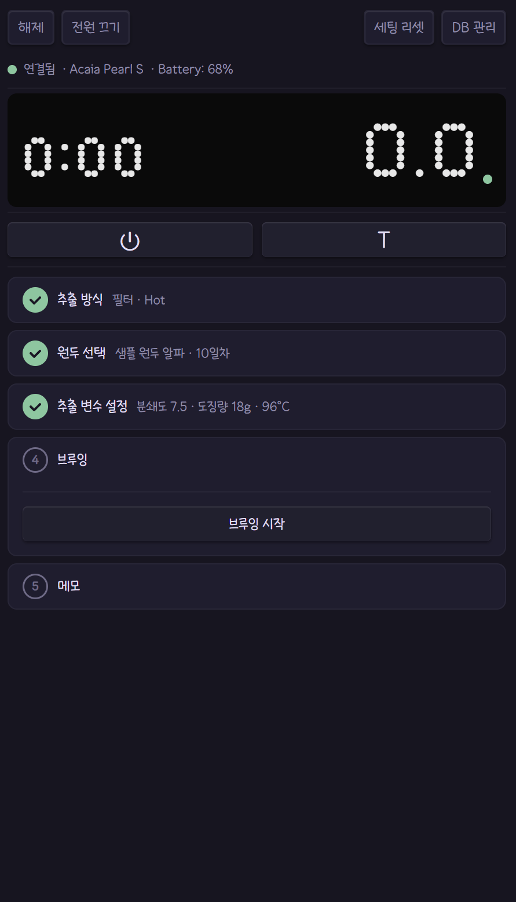
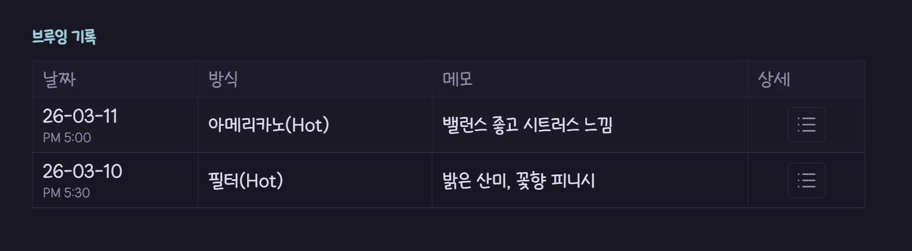
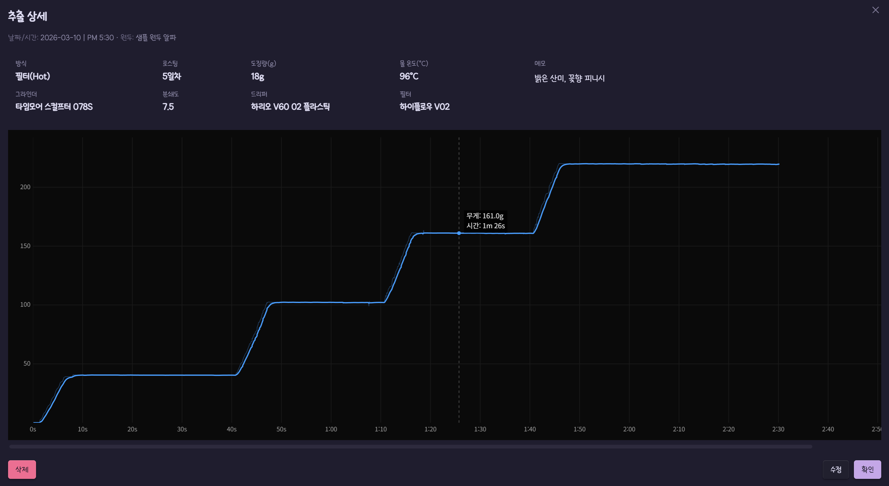

# CubicJ Brewing

[English](README.md) | **한국어**

커피 브루잉을 위한 [Obsidian](https://obsidian.md) 플러그인 — 실시간 BLE 저울 연동, 가이드 브루잉 플로우, 구조화된 기록 관리를 옵시디언 노트 안에서 기록합니다.

> 현재 **Windows**에서 **Acaia Pearl S**를 지원합니다. 다른 Acaia 모델 및 플랫폼은 계획 중입니다.

  
   
  <em>라이브 브루잉 세션 — Acaia Pearl S를 통한 실시간 무게 추적 및 프로파일 차트</em>

## 기능

- **실시간 저울 연결** — Acaia Pearl S 블루투스 연동
- **가이드 브루 플로우** — 5단계 아코디언 UI (방식 → 원두 → 파라미터 → 추출 → 저장)
- **필터 & 에스프레소 모드** — 추출 방식별 파라미터
- **라이브 브루 프로파일 차트** — 추출 중 실시간 무게-시간 그래프 기록, 호버 시 무게·유량·시간 표시
- **원두 인벤토리** — 로스팅 일수, 남은 원두 무게, 상태 추적
- **브루 히스토리** — 원두별/일자별 기록, 추출 그래프, 로스팅 경과일, 사용 장비, 인라인 메모 편집
- **장비 관리** — RPM 설정을 포함한 그라인더, 드리퍼, 필터, 바스켓, 액세서리
- **볼트 네이티브 저장** — 모든 데이터를 일반 파일로, Obsidian Sync 호환
- **다국어 지원** — 한국어, 영어, 커뮤니티 확장 가능

BLE와 브루잉 사이드바는 데스크톱(Windows) 전용이며, 원두 인벤토리·브루 히스토리·일일 기록은 모바일에서도 동작합니다.

## 스크린샷

  
   
  <em>원두 인벤토리 — 원두별 로스팅 일수, 남은 원두 무게, 상태 추적</em>

  
   
  <em>원두별 브루잉 히스토리 테이블</em>

  
   
  <em>브루잉 상세 — 추출 파라미터와 무게-시간 그래프</em>

## 설치

1. [최신 릴리즈](https://github.com/cubicj/CubicJ-Brewing/releases/latest)에서 `cubicj-brewing.zip` 다운로드
2. zip 압축 해제 — `main.js`, `manifest.json`, `styles.css`, `noble/` 폴더가 있어야 합니다.
3. 모든 내용을 `<볼트 경로>/.obsidian/plugins/cubicj-brewing/`에 복사
4. Obsidian 재시작 → 설정 → 커뮤니티 플러그인 → "CubicJ Brewing" 활성화

> `noble/` 폴더는 네이티브 블루투스 애드온입니다. 없어도 기록 기능은 그대로 동작하며, 저울 연결을 시도하거나 **설정 → 블루투스 애드온**에서 원클릭으로 다운로드해 설치할 수 있습니다(체크섬 검증 포함).

## 개인정보와 네트워크 사용

이 플러그인은 완전히 오프라인으로 동작합니다. 추출 기록, 원두, 레시피는 모두 볼트 안의 일반 Markdown 파일이며, 텔레메트리·분석·외부 서비스 연결이 전혀 없습니다.

네트워크 요청은 딱 한 종류입니다: 이 플러그인의 [GitHub 릴리즈](https://github.com/cubicj/CubicJ-Brewing/releases)에서 네이티브 블루투스 애드온(`noble.tar.gz`, 약 3 MB)을 내려받는 것으로, 저울과 블루투스로 통신하는 데 필요합니다.

- 다운로드는 사용자가 요청할 때만 일어납니다 — 애드온 없이 저울 연결을 시도할 때, 또는 **설정 → 블루투스 애드온**에서. 자동으로 내려받는 일은 없습니다.
- 다운로드는 설치된 플러그인 버전에 고정되며, 플러그인에 내장된 SHA-256 체크섬으로 검증한 뒤에만 설치됩니다.
- 애드온은 플러그인 폴더 안(`.obsidian/plugins/cubicj-brewing/noble/`)에만 저장됩니다. 볼트 밖의 파일은 읽거나 쓰지 않습니다.
- 애드온이 없어도 실시간 저울 연결을 제외한 모든 기능이 그대로 동작합니다.

## 문서

전체 문서는 **[위키](https://github.com/cubicj/CubicJ-Brewing/wiki)**에 있습니다:

- [설치](https://github.com/cubicj/CubicJ-Brewing/wiki/Installation-(Korean)) — 요구사항과 설치 절차
- [시작하기](https://github.com/cubicj/CubicJ-Brewing/wiki/Getting-Started-(Korean)) — 저울 연결과 단계별 브루 플로우
- [기록 관리](https://github.com/cubicj/CubicJ-Brewing/wiki/Record-Keeping-(Korean)) — 원두 재고, 브루잉 기록, 일일 기록
- [설정과 장비](https://github.com/cubicj/CubicJ-Brewing/wiki/Settings-and-Equipment-(Korean)) — 플러그인 설정과 장비 관리

## 감사의 말

- [Matrix Sans](https://github.com/FriedOrange/MatrixSans) 도트 매트릭스 폰트 — [SIL Open Font License 1.1](FONT-LICENSE-OFL.txt)

## 라이선스

[MIT](LICENSE)
