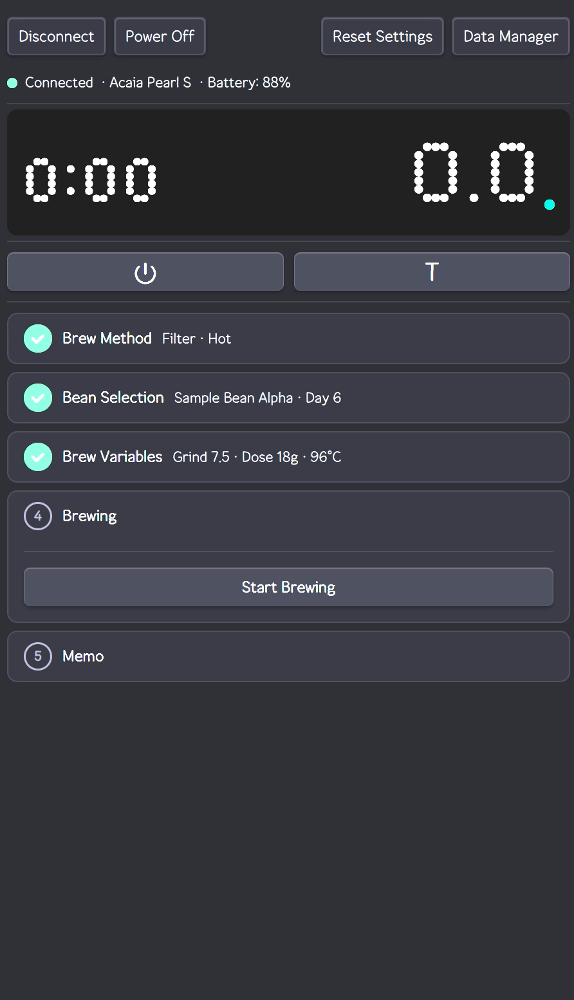
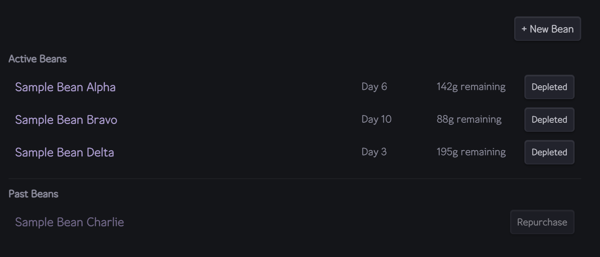
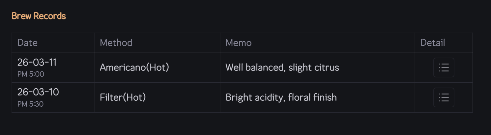
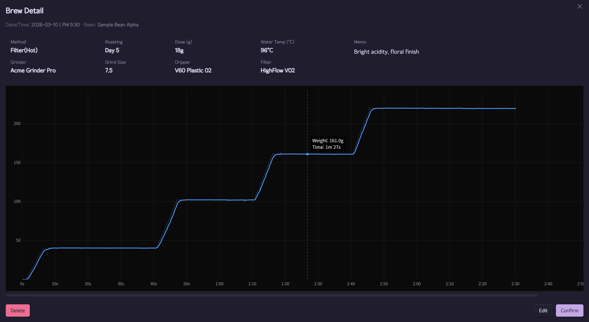

# CubicJ Brewing

[](LICENSE)


An [Obsidian](https://obsidian.md) plugin for coffee brewing — real-time BLE scale integration, guided brew flow, and structured record keeping, all inside your vault.

> Currently supports **Acaia Pearl S** on **Windows**. Other Acaia models and platforms are planned.

<p align="center">
  
  <br>
  <em>Live brewing session — real-time weight tracking and profile chart via Acaia Pearl S</em>
</p>

## Features

- **Real-time scale connection** — Acaia Pearl S via Bluetooth, no companion app required
- **Guided brew flow** — 6-step accordion UI (method → bean → parameters → brew → profile → save)
- **Filter & espresso modes** with method-specific parameter sets
- **Live brew profile chart** — weight-over-time curve recorded during brewing
- **Bean inventory** — roast days, remaining weight, status tracking
- **Brew history** — per-bean records with profile charts and equipment used
- **Equipment registry** — grinders, drippers, filters, baskets, accessories
- **Vault-native storage** — all data as plain files, Obsidian Sync compatible
- **Multi-language** — English and Korean, community-extensible
- **Global hotkeys** — hands-free connect, tare, start/stop brew

## Requirements

- **Obsidian Desktop** (Electron-based — BLE requires native addon)
- **Windows** with Bluetooth LE support
- **Acaia Pearl S** scale

> macOS/Linux support depends on [@stoprocent/noble](https://github.com/nicedoc/noble) platform compatibility. Not tested yet.

## Installation

1. Download `cubicj-brewing.zip` from the [latest release](https://github.com/cubicj/CubicJ-Brewing/releases/latest)
2. Extract the zip — you should see `main.js`, `manifest.json`, `styles.css`, and a `noble/` folder
3. Copy all contents into `<your-vault>/.obsidian/plugins/cubicj-brewing/`
4. Restart Obsidian → Settings → Community plugins → Enable "CubicJ Brewing"

> The `noble/` folder contains the native BLE addon — do not omit it.

## Usage

### Bean Inventory (`beans` code block)

Place a `beans` code block in any note to create a bean inventory hub:

````markdown
```beans
```
````

<p>
  
  <br>
  <em>Bean inventory — roast days, remaining weight, and status tracking per bean</em>
</p>

- **Active / Finished** sections — beans grouped by status
- **Roast days** — automatically calculated from roast date, refreshed daily
- **Remaining weight** — click to set, add, or subtract (with optional scale auto-read)
- **Status toggle** — mark as finished or repurchase with new roast date
- **New bean button** — creates a bean note with frontmatter template and a `brews` block

> The `beans` block is **not created automatically** — add it manually to a note of your choice (e.g., a "Coffee Dashboard" note). One block per vault is enough.

### Bean Notes

Each bean is a regular note with `type: bean` frontmatter:

```yaml
---
type: bean
roaster: My Roaster
status: active
roast_date: 2026-03-01
weight: 200
---
```

The plugin discovers beans via Obsidian's metadata cache — no special folder structure required.

### Brew Records (`brews` code block)

Each bean note includes a `brews` code block (auto-inserted on creation) that shows its brew history:

````markdown
```brews
```
````

<p>
  
  <br>
  <em>Per-bean brew history table</em>
</p>

<p>
  
  <br>
  <em>Brew detail — extraction parameters and weight-over-time profile chart</em>
</p>

---

## Architecture

```
TypeScript · vitest · esbuild CommonJS bundle
```

| Layer | Key Components |
|-------|----------------|
| **BLE** | Binary protocol codec, packet buffer (fragmentation handling), typed EventEmitter service |
| **Brew State** | 6-step finite state machine with step guards and discriminated union records |
| **Signal** | Median spike filter, Savitzky-Golay smoothing (order 2), EMA trend line |
| **Storage** | File-adapter abstraction, JSON CRUD with schema validation, corrupt-file backup |
| **Views** | Accordion manager, stepper component, Canvas 2D chart, code block processors |

## Development

```bash
npm run dev          # watch mode + auto-copy to vault
npm run build        # test → typecheck → production build
npm run test         # vitest (single run)
npm run test:watch   # vitest (watch mode)
npm run check        # typecheck only
npm run lint         # eslint
```

### Build from Source

```bash
git clone https://github.com/cubicj/CubicJ-Brewing.git
cd CubicJ-Brewing
npm install
npm run build
npm run release      # generate release zip
```

## Acknowledgments

- [Matrix Sans](https://github.com/FriedOrange/MatrixSans) dot-matrix font — [SIL Open Font License 1.1](FONT-LICENSE-OFL.txt)

## License

[MIT](LICENSE)
