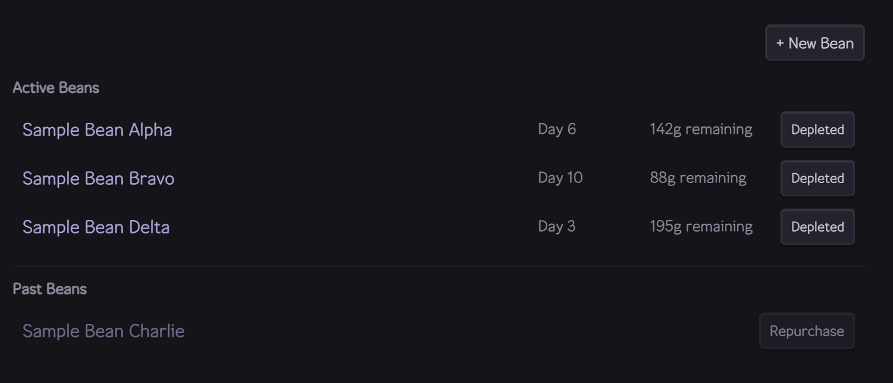
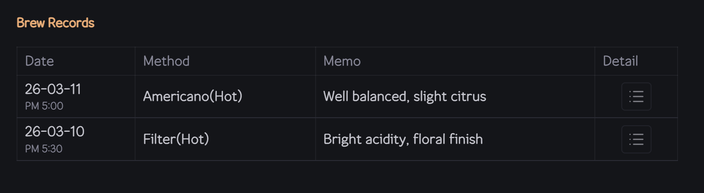
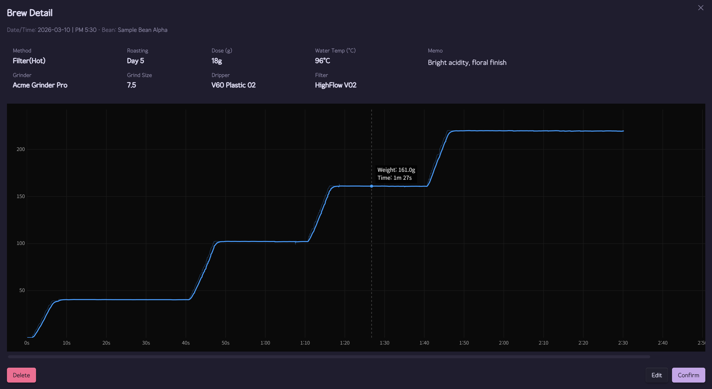

# CubicJ Brewing

**English** | [한국어](README.ko.md)

An [Obsidian](https://obsidian.md) plugin for coffee brewing — real-time BLE scale integration, guided brew flow, and structured record keeping, all inside your vault.

> Currently supports **Acaia Pearl S** on **Windows**. Other Acaia models and platforms are planned.

  
   
  <em>Live brewing session — real-time weight tracking and profile chart via Acaia Pearl S</em>

## Features

- **Real-time scale connection** — Acaia Pearl S via Bluetooth, no companion app required
- **Guided brew flow** — 5-step accordion UI (method → bean → parameters → brew → save)
- **Filter & espresso modes** with method-specific parameter sets
- **Live brew profile chart** — weight-over-time curve recorded during brewing, with hover readout of weight, flow rate, and time
- **Bean inventory** — roast days, remaining weight, status tracking
- **Brew history** — per-bean and daily records with profile charts, roast age, equipment used, and inline memo editing
- **Equipment registry** — grinders with RPM settings, drippers, filters, baskets, accessories
- **Vault-native storage** — all data as plain files, Obsidian Sync compatible
- **Multi-language** — English and Korean, community-extensible

BLE and the brewing sidebar are desktop-only (Windows); bean inventory, brew history, and daily records also work on mobile.

## Screenshots

  
   
  <em>Bean inventory — roast days, remaining weight, and status tracking per bean</em>

  
   
  <em>Per-bean brew history table</em>

  
   
  <em>Brew detail — extraction parameters and weight-over-time profile chart</em>

## Installation

**From the Community directory (recommended)**

1. In Obsidian, open **Settings → Community plugins → Browse** and search for "CubicJ Brewing"
2. Install and enable the plugin
3. To connect the scale, accept the one-click Bluetooth addon download when prompted, or use **Settings → Bluetooth addon**

**Manual install**

1. Download `cubicj-brewing.zip` from the [latest release](https://github.com/cubicj/CubicJ-Brewing/releases/latest)
2. Extract the zip — you should see `main.js`, `manifest.json`, `styles.css`, and a `noble/` folder
3. Copy all contents into `<your-vault>/.obsidian/plugins/cubicj-brewing/`
4. Restart Obsidian → Settings → Community plugins → Enable "CubicJ Brewing"

> The zip bundles the native Bluetooth addon (`noble/`), so manual installs work fully offline. If the folder is missing, record keeping still works — the plugin offers the same checksum-verified addon download when you try to connect the scale.

## Privacy and network access

The plugin works entirely offline. Brew records, beans, and recipes are plain Markdown files in your vault. There is no telemetry, no analytics, and no connection to any external service.

The plugin performs exactly one kind of network request: downloading the native Bluetooth addon (`noble.tar.gz`, about 3 MB) from this plugin's own [GitHub releases](https://github.com/cubicj/CubicJ-Brewing/releases). The addon is required to talk to the scale over Bluetooth.

- The download only happens when you ask for it — when you try to connect the scale without the addon installed, or from **Settings → Bluetooth addon**. Nothing is downloaded automatically.
- The download is pinned to the installed plugin version and verified against a SHA-256 checksum built into the plugin before anything is installed.
- The addon is stored inside the plugin's own folder (`.obsidian/plugins/cubicj-brewing/noble/`). The plugin does not read or write files outside your vault.
- Without the addon, everything except the live scale connection keeps working.

## Documentation

Full documentation lives in the **[wiki](https://github.com/cubicj/CubicJ-Brewing/wiki)**:

- [Installation](https://github.com/cubicj/CubicJ-Brewing/wiki/Installation) — requirements and install steps
- [Getting Started](https://github.com/cubicj/CubicJ-Brewing/wiki/Getting-Started) — scale connection and the guided brew flow
- [Record Keeping](https://github.com/cubicj/CubicJ-Brewing/wiki/Record-Keeping) — bean inventory, brew history, daily records
- [Settings & Equipment](https://github.com/cubicj/CubicJ-Brewing/wiki/Settings-and-Equipment) — plugin settings and gear management

## Acknowledgments

- [Matrix Sans](https://github.com/FriedOrange/MatrixSans) dot-matrix font — [SIL Open Font License 1.1](FONT-LICENSE-OFL.txt)

## License

[MIT](LICENSE)
