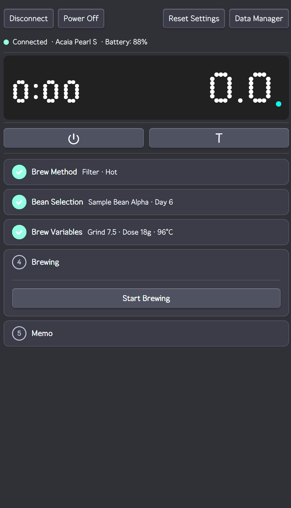

# CubicJ Brewing

[한국어](README.ko.md)

An [Obsidian](https://obsidian.md) plugin for coffee brewing — real-time BLE scale integration, guided brew flow, and structured record keeping, all inside your vault.

> Currently supports **Acaia Pearl S** on **Windows**. Other Acaia models and platforms are planned.

  
   
  <em>Live brewing session — real-time weight tracking and profile chart via Acaia Pearl S</em>

## Features

- **Real-time scale connection** — Acaia Pearl S via Bluetooth, no companion app required
- **Guided brew flow** — 5-step accordion UI (method → bean → parameters → brew → save)
- **Filter & espresso modes** with method-specific parameter sets
- **Live brew profile chart** — weight-over-time curve recorded during brewing, with hover readout of weight, flow rate, and time
- **Bean inventory** — roast days, remaining weight, status tracking
- **Brew history** — per-bean and daily records with profile charts, roast age, equipment used, and inline memo editing
- **Equipment registry** — grinders with RPM settings, drippers, filters, baskets, accessories
- **Vault-native storage** — all data as plain files, Obsidian Sync compatible
- **Multi-language** — English and Korean, community-extensible

BLE and the brewing sidebar are desktop-only (Windows); bean inventory, brew history, and daily records also work on mobile.

## Installation

1. Download `cubicj-brewing.zip` from the [latest release](https://github.com/cubicj/CubicJ-Brewing/releases/latest)
2. Extract the zip — you should see `main.js`, `manifest.json`, `styles.css`, and a `noble/` folder
3. Copy all contents into `<your-vault>/.obsidian/plugins/cubicj-brewing/`
4. Restart Obsidian → Settings → Community plugins → Enable "CubicJ Brewing"

> The `noble/` folder contains the native BLE addon — do not omit it.

## Documentation

Full documentation lives in the **[wiki](https://github.com/cubicj/CubicJ-Brewing/wiki)**:

- [Installation](https://github.com/cubicj/CubicJ-Brewing/wiki/Installation) — requirements, install steps, building from source
- [Getting Started](https://github.com/cubicj/CubicJ-Brewing/wiki/Getting-Started) — scale connection, brew flow, code blocks, commands, settings
- [Troubleshooting](https://github.com/cubicj/CubicJ-Brewing/wiki/Troubleshooting) — connection issues, data recovery, debug logging

## Acknowledgments

- [Matrix Sans](https://github.com/FriedOrange/MatrixSans) dot-matrix font — [SIL Open Font License 1.1](FONT-LICENSE-OFL.txt)

## License

[MIT](LICENSE)
